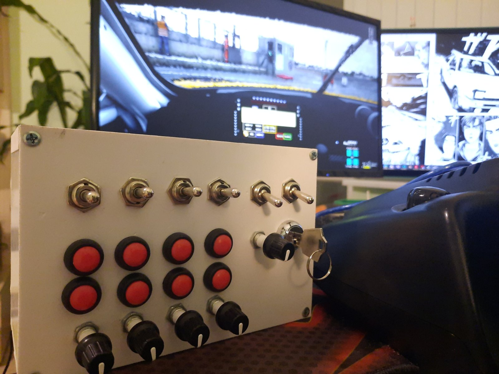

# ButtonBox
Button box is a project, driven by Arduino UNO. Its purpose is to provide a more realistic feel to racing simulators, aiming to replicate a button box found inside the car.
It uses the serial port to communicate with a python script, reading from the serial port and emulating key strokes. The button box is powered by USB and connects directly to the computer, running the Python script.

